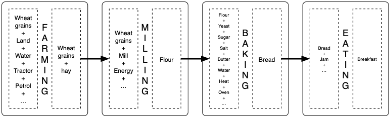

From wheat to bread
-------------------

To describe a more sophisticated  system involving multiple nodes, let
us go back to our bread example.

The simplest form
^^^^^^^^^^^^^^^^^

As this  model is  more about  agriculture than  eating bread,  let us
start with  an annual  process. Let  us also  start with  the simplest
model possible. Later,  more complexity will be introduced  in it with
constraints on land, mills, oven, etc.

.. literalinclude:: ./examples/bread.txt
   :language: text

This is obviously oversimplified. But it  clearly shows how to use the
grammar.

In practice, the  farmer must decide how much land  it uses for wheat,
the miller must be capable of milling the resulting quantity, etc.

Limitations on land
^^^^^^^^^^^^^^^^^^^

Farming requires  land. Let  us add  some constraints  on land  in the
model.  First, the  farmer  has  a maximum  of  1000  hectares at  his
disposal. Because of  some environmental constraint, he  must at least
use 100 hectares for producing wheat.

.. literalinclude:: ./examples/bread_limitation_on_land.txt
   :language: text
   :emphasize-lines: 8,9,15,16
      
But there  is a missing  piece: if there is  a limitation on  how much
wheat can  be produced, there  must be  some flexibility at  the other
hand of  the chain to  deal with  it. 

.. literalinclude:: ./examples/bread_limitation_on_land_2.txt
   :language: text
   :emphasize-lines: 7,10,12,14

What about the minimum production constraint? There must also be a way
to store it  if not all is  consumed. There are several  options to do
so. One can store grains, flours or even bread. That's where the model
starts  delivering some  interesting features.  The solver  behing the
scene will find  the optimal storage option depending on  the costs of
the different solutions.

In the following  model, the system will be able  to store grains when
farming, flour when milling and bread when baking. Let us live for the
moment with the assumption that bread  can be stored for 1 year, which
is admittedly a big assumption.

.. literalinclude:: ./examples/bread_limitation_on_land_3.txt
   :language: text
   :emphasize-lines: 6,7,10,11,14,15,16,18,22,23,26,27,28,30,31,32,34,42,43,47,48,53,55,56,58

Using this model, the solver will find a balance between producing and
storing  resources. Next  level of  modelling requires  to size  these
storages.

Investing
^^^^^^^^^

Let us focus on the stock of flour, the others being similar
except for the costs.

.. literalinclude:: ./examples/bread_investing.txt
   :language: text
   :emphasize-lines: 7,8,9,10,13,18,19,20,24,xs27

