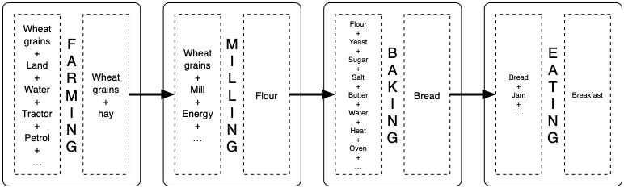

************
Introduction
************

Optimising  complex  systems is  usually  tedious.  It does  not  only
require modelling skills but also  optimisation mastery and often some
coding skills too.

For example,  power systems  are one  typical complex  systems because
there is a duality between power (what is instantaneously consumed and
needs to be produced at the exact same time) and energy (what has been
consumed or produced over a specific period of time).

Long term optimisation of power systems requires to model both what is
produced and consumed  at every time-step (typically  on hourly basis)
and what  should be invested in  terms of production assets  to assess
how supply meets  demand on the short  term and on the long  term in a
cost effective way.

But  power  systems do  function  alone.   Fuels  such as  gas,  coal,
uranium, etc must be delivered to  power plants. And every single fuel
is also part of a complex system  to extract it somewhere and carry it
to where it  will be consumed. What's more, some  power plants, namely
wind  turbines and  photovoltaic panels,  depend on  external factors:
wind(speed) and  radiation respectively. These factors  themselves are
inherently variable and depend on geographic location.

The  integration of  energy  markets provides  more  and more  distant
players  with the  ability  to  close deals  at  a  faster and  faster
pace. As  a consequence  of better  markets functionning,  systems are
even more  intertwinned than before.   There is a need  for simulating
and optimising these previously separated systems as a whole, i.e.  as
one single system, to assess interactions among players and trade-offs
among fuels.

What's true for energy systems is also true for all other sectors. So,
this need goes beyond traditional energy systems (electricity, gas...)
as  electric transportation  grows, leading  to an  even more  complex
integrated system.

The purpose of GSML
===================

The purpose of GSML is to  facilitate the modelling of systems whether
simple  simulations  or  complex  optimizations  for  further  use  in
simulation and optimisation tools.  GSML enables the users to focus on
modelling systems without the burden  of identifying the most adequate
optimisation  method   and  implementing  it.   It   enables  defining
businesses with  the adequate level  of details  not only in  terms of
technical parameters but also in  financial terms.  The user can focus
on describing, on  the one hand, the relationships  between inputs and
outputs  of all  the  processes and  on the  other  hand, among  their
counterparts,  the  cash  flows  resulting  from  costs  and  revenues
associated with  these processes. The  level of details  is adequately
chosen by the user depending on what she or he wants to analyse.

Let us  look at a not-so-simple example.

.. comments
   image:: ./illustrations/first_example.svg
   :width: 600px
   :alt: Not-so-simple Example 
   :align: center

In  the   GSML  approach,  businesses/processes  are   represented  as
**nodes**  of a  directed graph.   These nodes  are connected  to each
other through **edges**.  The term *process*  is taken in a very broad
sense of  the word.  A process can  as well be  a physical  process by
which inputs are transformed into outputs  as a more abstract one such
as exchanges where goods are traded.

An illustration
===============

To illustrate GSML, we will start  with a much simpler example. Let us
investigate another example: *baking bread*.

In this  example, the  system starts  with a  farmer who  plants wheat
grains in order  to harvest a larger  volume of the same  grains a few
months later.  This farmer sells his  grains to a miller who will mill
them into flour. Then  this miller sells some of his  flour to a baker
who will produce breads. Breads are  sold to the end customers. Let us
stop  at this  stage for  now.

This is  a rather  simple system... even  tough all  participants need
other  elements (inputs)  than  what  has been  mentionned  so far  to
perform their respective  job and achieve their  objective.  The farmer
needs a tractor with specific equipment to harvest, etc.

   
In the sequel of this GSML documentation, the focused will first be on
the  **base   grammar**  itself  before  moving   to  more  **advanced
features** aiming at simplifying the modelling.

