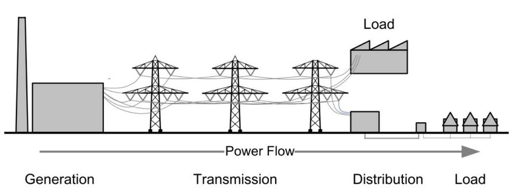

************
Introduction
************

Optimising  complex  systems is  usually  tedious.  It does  not  only
require modelling skills but also  optimisation mastery and often some
coding skills too.

Power systems are typical complex systems to model because electricity
cannot easily be stored and  restored without substantial losses (both
physical and financial).  It has to  be produced at exactly the moment
it is consumed.  When modelling a  power system, there is a duality to
reprensent between  power (what is instantaneously  consumed and needs
to  be produced  at the  exact same  time) and  energy (what  has been
consumed or produced  over a specific period of time).  Energy is just
the sum of power over time.

   Traditional power system structure (1879-2000) 

Long term optimisation of power systems requires to model both what is
produced and consumed  at every time-step (typically  on hourly basis)
and what  should be invested in  terms of production assets  to assess
how supply meets  demand on the short  term and on the long  term in a
cost effective way.

But power  systems do not  function alone.   Fuels such as  gas, coal,
uranium, etc must be delivered to  power plants. And every single fuel
is also part of a complex system  to extract it somewhere and carry it
to where it  will be consumed. What's more, some  power plants, namely
wind  turbines and  photovoltaic panels,  depend on  external factors:
wind(speed) and  radiation respectively. These factors  themselves are
inherently variable and depend on geographic location.

The  integration of  energy  markets provides  more  and more  distant
players  with the  ability  to  close deals  at  a  faster and  faster
pace. As  a consequence  of better  markets functionning,  systems are
even more  intertwinned than before.   There is a need  for simulating
and optimising these previously separated systems as a whole, i.e.  as
one single system, to assess interactions among players and trade-offs
among fuels.

What's true for energy systems is also true for all other sectors. So,
this need goes beyond traditional energy systems (electricity, gas...)
as  electric transportation  grows, leading  to an  even more  complex
integrated system.

The purpose of GSML
===================

The purpose of GSML is to  facilitate the modelling of systems whether
simple  simulations  or  complex  optimizations  for  further  use  in
simulation and optimisation tools.  GSML enables the users to focus on
modelling systems without the burden  of identifying the most adequate
optimisation  method   and  implementing  it.   It   enables  defining
businesses with  the adequate level  of details  not only in  terms of
technical parameters but also in  financial terms.  The user can focus
on describing, on  the one hand, the relationships  between inputs and
outputs  of all  the  processes and  on the  other  hand, among  their
counterparts,  the  cash  flows  resulting  from  costs  and  revenues
associated with  these processes. The  level of details  is adequately
chosen by the user depending on what she or he wants to analyse.

In  the   GSML  approach,  businesses/processes  are   represented  as
:ref:`nodes<node>` of a directed graph.   These nodes are connected to
each other through :ref:`edges<edge>`.  The term *process* is taken in
a very broad sense  of the word.  A process can as  well be a physical
process  by  which inputs  are  transformed  into  outputs as  a  more
abstract one such as exchanges where goods are traded.

Simple illustration
===================

To illustrate GSML, we will start  with a much simpler example. Let us
investigate another example: *baking bread*.

   From wheat grains to sandwiches

In this  example, the system starts  with a farmer who  harvests wheat
grains. At some point, he sells these grains to a miller who will turn
them into flour.  A baker buys this flour to  produce breads that will
be sold to consumers who will eventually turn them into sandwiches.

This  is  a rather  simple  system...  In  practice however,  all  the
involvedparticipants need  lots of other elements  (inputs) to perform
their respective  job and achieve  their objective.  The  farmer needs
grains from a previous harvest, which he  will sow. To sow, he needs a
tractor  to plough  the  ground  and scatter  the  seeds. The  tractor
requires gas oil to function. He also need a combine harvester, and so
on and so forth. The other participants have needs too.

In the end, the simple system can  also be described as a very complex
system involving  many participants  from the tractor  manufacturer to
the factory that  will produce the mayo the consumer  will spread over
the slices of bread, which he will use for his sandwich.

A grammar
=========

`Wikipedia  <https://en.wikipedia.org/wiki/Grammar>`_   says  that  *in
linguistics, grammar  (from Ancient  Greek γραμματική)  is the  set of
structural  rules governing  the composition  of clauses,  phrases and
words in a natural language*.

With  GSML, we  want  to  propose a  natural  language for  describing
optimisation problems  in *relatively* simple terms.  Hence, the focus
of the user can be on  properly modelling things rather than coding an
optimisation problem in any appropriate coding language.
   
In the  sequel of  this documentation,  the focused  will first  be on
introducing a  :ref:`base grammar<base  grammar>`.  This  base grammar
requires  to be  exhaustive in  describing  the processes  in each  in
node. Then,  we will introduce a  more :ref:`advanced grammar<advanced
grammar>`  aiming at  shortening and  simplifying the  description but
resulting in the exact same modelling.

